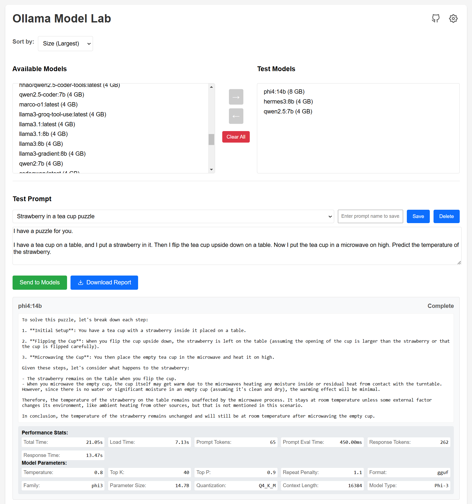

# Ollama Model Lab

A web-based interface for testing and comparing different Ollama models with customizable parameters and prompts.



## Overview

Ollama Model Lab provides an intuitive playground for exploring and comparing different Ollama models. Unlike typical chat interfaces or benchmark tools, this lab environment allows you to:

- Test multiple models simultaneously with the same prompt
- Compare detailed performance metrics and response characteristics
- Customize model parameters and observe their impact
- Generate comprehensive comparison reports
- Save and manage frequently used prompts

Example comparison report output:
```markdown
### phi4:14b vs hermes3:8b vs qwen2.5:7b
Performance comparison:
- phi4:14b: 21.05s total (7.13s load)
- hermes3:8b: 6.52s total (4.45s load)
- qwen2.5:7b: 9.31s total (4.19s load)

Each model's response includes:
✓ Token counts and timing
✓ Parameter settings used
✓ Model architecture details
✓ Full response text
```

See [example-report.md](example-report.md) for a complete sample output.

## Prerequisites

- [Ollama](https://ollama.ai/) installed and running
- At least one Ollama model pulled
- Python 3.x (if using the included server script)
- A modern web browser

## Quick Start

1. Get the files:
   - Download the latest release ZIP file from the [Releases](https://github.com/designcomputer/ollama-model-lab/releases) page
   - Extract the ZIP file to your desired location
   
   *Alternative for contributors: Clone the repository*
   ```bash
   git clone https://github.com/designcomputer/ollama-model-lab.git
   cd ollama-model-lab
   ```

2. Start a local web server:
   - Windows users can double-click `start.bat`
   - Or use any method to serve the files locally:
     ```bash
     # Python 3.x (default port 80)
     python -m http.server 80
     
     # Use a different port if 80 is in use
     python -m http.server 8080
     
     # Python 2.x
     python -m SimpleHTTPServer 80
     
     # Or use any other local server of your choice
     ```

3. Ensure Ollama is running (default: http://127.0.0.1:11434)

4. Open your browser and navigate to:
   ```
   http://localhost           # if using port 80
   http://localhost:8080      # if using port 8080 (or your chosen port)
   ```

## Features

### Model Management
- View all available Ollama models
- Select multiple models for testing
- Sort models by name or size
- Clear test selection with one click

### Parameter Configuration
- Override default model parameters:
  - Temperature
  - Context Window
  - Max Tokens
  - Top K
  - Top P
  - Number of GPUs
  - Memory Mapping

### Prompt Management
- Save frequently used prompts
- Import/Export prompt collections
- Quick selection of saved prompts
- Example prompts included

### Response Analysis
- Side-by-side response comparison
- Detailed performance statistics
  - Total processing time
  - Load time
  - Token counts
  - Processing durations
- Model-specific information display
- Generate detailed comparison reports

## Usage Tips

1. **Selecting Models**:
   - Use the left panel to choose available models
   - Click the right arrow to add them to your test set
   - Click the left arrow to remove models from testing

2. **Configuring Parameters**:
   - Select a model in the right panel
   - Click the gear icon to open parameter settings
   - Enable only the parameters you want to override

3. **Managing Prompts**:
   - Save useful prompts with descriptive names
   - Use the dropdown to quickly load saved prompts
   - Import/Export prompts via Settings

4. **Generating Reports**:
   - Run your test across all selected models
   - Click "Download Report" to save a detailed markdown report
   - Reports include all responses and statistics

## Settings

Access the settings modal to:
- Configure the Ollama server URL
- Import/Export saved prompts
- View version information

## Troubleshooting

### Port Configuration
- If port 80 is already in use (common with web servers or other services):
  1. Modify `start.bat` to use a different port number
  2. Or start the server manually with a different port: `python -m http.server 8080`
  3. Remember to access the application using the correct port in your browser URL

### Common Issues
- Ensure Ollama is running before starting the application
- Check the Ollama server URL in settings if models aren't loading
- Clear your browser cache if you experience UI issues
- Make sure your chosen port isn't blocked by firewall settings

## Contributing

Contributions are welcome! Please feel free to submit a Pull Request.

## License

This project is licensed under the MIT License - see the [LICENSE](LICENSE) file for details.

## Acknowledgments

- Built for use with [Ollama](https://ollama.ai/)
- Uses browser IndexedDB for prompt storage
- Inspired by the need for easy model comparison

## Support

If you encounter any issues or have questions:
1. Check the [Issues](https://github.com/designcomputer/ollama-model-lab/issues) page
2. Submit a new issue with detailed information about your problem
3. Include your browser and Ollama versions when reporting issues